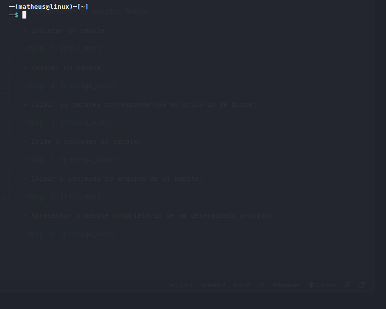
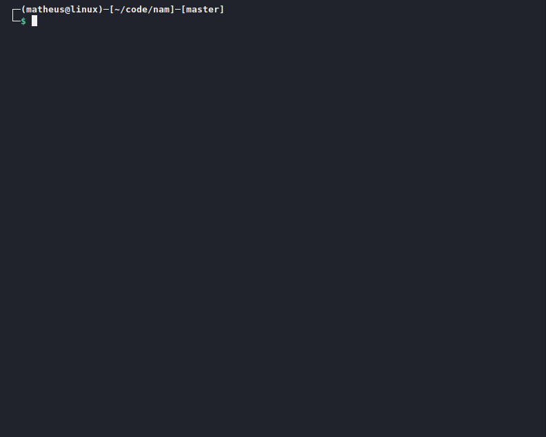

<h1 align="center"></h1>

<p align="center">
    <a href="#about-the-project">About the project</a>&nbsp;&nbsp;&nbsp;|&nbsp;&nbsp;&nbsp;
    <a href="#how-to-use">How to use</a>&nbsp;&nbsp;&nbsp;|&nbsp;&nbsp;&nbsp;
    <a href="#installation">Installation</a>&nbsp;&nbsp;&nbsp;|&nbsp;&nbsp;&nbsp;
    <a href="#contributing">Contributing</a>&nbsp;&nbsp;&nbsp;|&nbsp;&nbsp;&nbsp;
    <a href="#license">License</a>
</p>

<br>

## About the project
Nam is a command line tool to view simpler command help pages, with a focus on practical examples.



<!-- USAGE -->
## How to use
Type nam followed by the command name

Example:
```
nam zip
```
For more options enter `nam --help`

<!-- INSTALATION -->
## Installation
#### 1. Install python
```
sudo apt install python3
```

#### 2. Clone git repository
```
git clone "https://github.com/almeida-matheus/nam"
```

#### 3. Execute install.sh
```
cd nam/
chmod +x install.sh
sudo ./install.sh
```



<!-- CONTRIBUTING -->
## Contributing
1. Fork the project
2. Create your branch (`git checkout -b branch-name`)
3. Add your changes (`git add .`)
4. Commit your changes (`git commit -m 'add some feature'`)
5. Push to the branch (`git push origin branch-name`)
6. Open a pull request

<!-- LICENSE -->
## License
Distributed under the MIT License. See [LICENSE](LICENSE) for more information.