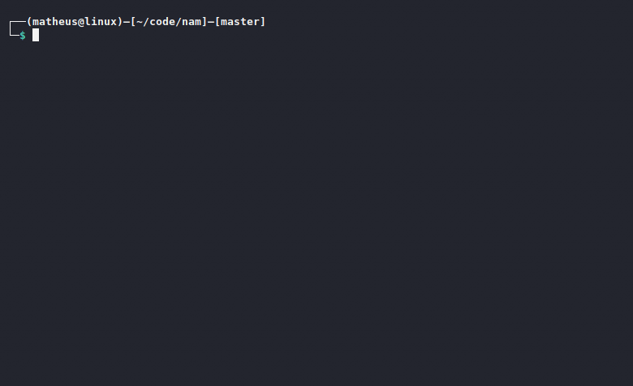

<h1 align="center"></h1>

<p align="center">
    <a href="#about-the-project">About the project</a>&nbsp;&nbsp;&nbsp;|&nbsp;&nbsp;&nbsp;
    <a href="#how-to-use">How to use</a>&nbsp;&nbsp;&nbsp;|&nbsp;&nbsp;&nbsp;
    <a href="#installation">Installation</a>&nbsp;&nbsp;&nbsp;|&nbsp;&nbsp;&nbsp;
    <a href="#contributing">Contributing</a>&nbsp;&nbsp;&nbsp;|&nbsp;&nbsp;&nbsp;
    <a href="#license">License</a>
</p>

<br>

## About the project
Nam is an interface for viewing terminal commands with their main parameters


<!-- USAGE -->
## How to use
Type nam followed by the command name

Example:
```
nam tar
```
For more options type `nam --help`

Output:


<!-- INSTALATION -->
## Installation
#### 1. Install Python
```
sudo apt install python3
```

#### 2. Clone git repository
```
git clone "https://github.com/almeida-matheus/nam"
```

#### 3. Execute install.sh
```
cd nam/
chmod +x install.sh
sudo ./install.sh
```

<!-- CONTRIBUTING -->
## Contributing
1. Fork the Project
2. Clone this project (`https://github.com/almeida-matheus/nam`)
3. Create your Feature Branch (`git checkout -b nameBranch`)
4. Add your Changes (`git add .`)
5. Commit your Changes (`git commit -m 'Add some feature'`)
6. Push to the Branch (`git push origin nameBranch`)
7. Open a Pull Request

<!-- LICENSE -->
## License
Distributed under the MIT License. See [LICENSE](LICENSE) for more information.